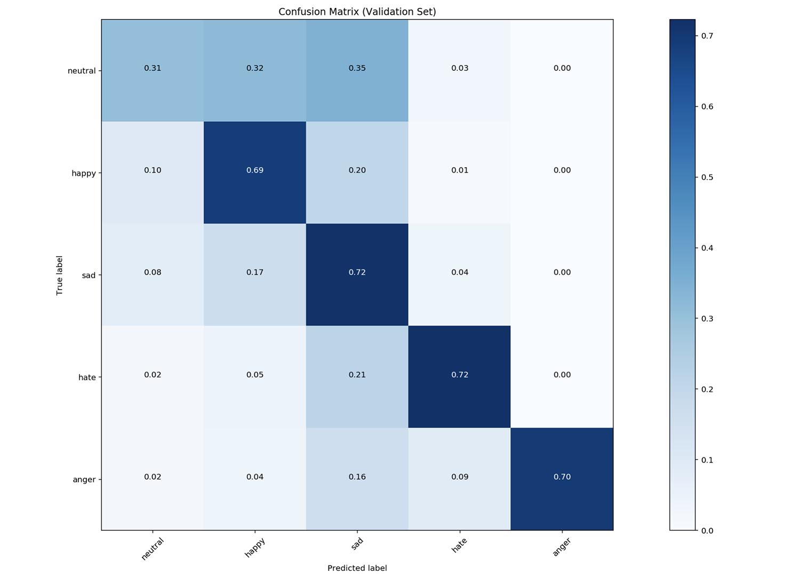
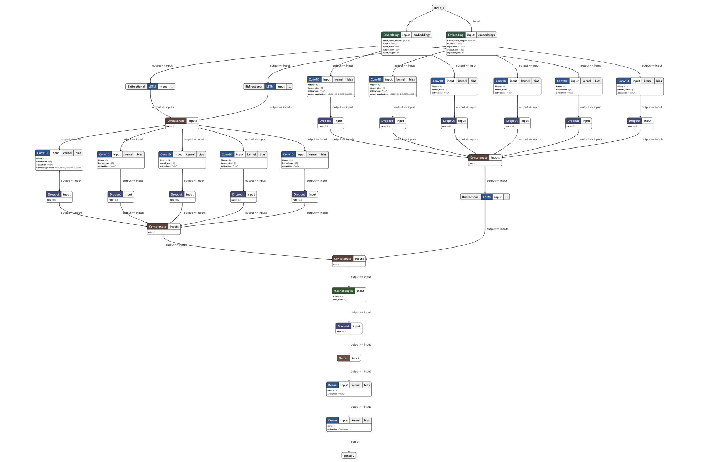

# Multi-class Emotion Classification for Tweets

**Associating specific emotions to short sequences of texts**

We propose using "multi-channel" combinations of convolutional kernels (aka CNN) and Long Short-Term Memory (LSTM) units to classify short text sequences (tweets) into one of five emotional classes, as opposed to binary (positive/negative) or ternary (positive/negative/neutral).

Classifing short sequences of text into many classes is still an uncommon topic of research. In particular, with the exception of Bouazizi and Ohtsuki (2017), few authors describe the effectiveness of classifing short text sequences (such as tweets) into anything more than 3 distinct classes (positive/negative/neutral). In particular, Bouazizi and Ohtsuki only achieved an overall accuracy of 56.9% or 60.2% of seven distinct classes in two of their papers. We hope to propose a new approach that can improve classification accuracy by a appreciable amount.

Our training and validation dataset is comprised of 47,288 tweets from Twitter with labelled emotions of five classes: **neutral**, **happy**, **sad**, **anger**, **hate**.

We have achieved a positive result by achieving exceeding **62%** overall classification accuracy and precision.

In particular, we have achieved good classification accuracy on happy, sad, hate and anger (97% precision!) classes. Hate and anger were sometimes misclassified as sadness.

Compared to previous papers on this specific problem (Bouazizi and Ohtsuki, 2017), we fared worse in classifying neutral and hate, but fared better in sadness and anger. Happiness is not a good comparison due to us merging two similar classes (fun and happy, or love and happy) as compared to the original paper.

## Methodology

We were inspired by previous work by other pioneers in the sentiment analysis and sentence classification field. Of note are the following:

- *Convolutional Neural Networks for Sentence Classification* (Yoo Kim, 2014)
- *Twitter Sentiment Analysis using combined LSTM-CNN Models* (Sosa, 2017)
- *A Pattern-Based Approach for Multi-Class Sentiment Analysis in Twitter* (Bouazizi and Ohtsuki, 2017)
- *Sentiment Analysis: from Binary to Multi-Class Classification* (Bouazizi and Ohtsuki, 2017)
- *Experimenting with Distant Supervision for Emotion Classification* (Purver and Battersby, 2012)

### Choice of Neural Network Model

**TLDR: why choose when you can have all??? `All your neural network are belong to us`**

Long Answer: We play to the strengths of various approaches.

RNN, especially LSTM, is preferred for many NLP tasks as it "learns" the significance of order of sequential data (such as texts). On the other hand, CNNs extract features from data to identify them. Previous approaches either use one method (Yoo Kim, 2014) or take a hybrid approach (Sosa, 2017). 

We take elements from each of the above models and extend the idea of creating multi-channel networks where we allow the model to *attempt* to self-learn which channels allow it to get better predictions for certain classes of data. Our hypothesis is this will allow the model to use the overall advantages of the different channels to make overall better predictions.

We call our prototype neural network **BalanceNet**.

### Multi-channel Approach

We omit having to make the following choices:

**Freezing the weights of the word embeddings from pre-trained GloVe vectors:**
Thus, We make a copy of the word embeddings and only allow the back-propagation to change the weights on one of two copies. This will hypothetically allow the model to both maintain generalised embeddings and learn more specific embeddings and use whichever is more suitable. This approach was proposed by Yoo Kim (2014).

**Choosing the CNN kernel size:**
We use multiple kernel sizes to allow features of different sizes to be extracted from input data. Again, this approach was proposed by Yoo Kim (2014).

**Choosing the order of which we pass the input sequence into the model (CNN to LSTM or LSTM to CNN):**
Sosa (2017) showed that a LSTM-CNN model works better than a CNN-LSTM, pure CNN or pure LSTM model. However, the differences in actual accuracy remain close, and differ according to the different classes. Hence, we use both approaches so we can take advantage of both **extract features from sequential output from the LSTM** (LSTM-CNN) and **extract features to be fed into LSTM** (CNN-LSTM).

We can concatenate all the channels and perform max-pooling. The last layer is a fully-connected layer which will then produce a prediction via a softmax activation function.

We introduce dropout and L2 regularisation at specific portions of the network (especially the higher kernel sizes) to reduce the possibility of over fitting the training data.

# Dataset

## Original Dataset

The original dataset is comprised of 40,000 tweets classified into 13 emotion classes. However, previous authors have described that several of those classes were in fact extremely similar, and repeated efforts to re-label the data only result in 72% agreement. Hence, we make the decision to combine several of those classes into five final classes. These five classes are also the same as in Bouazizi and Ohtsuki (2017), with the absence of the sarcasm and love classes (*Binary to Multi-Class Classification*) or fun and love classes (*Pattern-Based Approach for Multi-Class Sentiment Analysis*). 

## Additional Data

We also pulled data from the Twitter using Twitter API as additional training data. The tweets are classified with their own hashtags - for example "#happy".
We feel that hashtags should be a appreciably good (but far from perfect) representation of the sentiment of the tweet. While it is conceiveable for someone to tweet something like "Uh, I got 90 for A levels #sad", this is a very small minority and can be taken statistical noise, which might have the added benefit of reduce over-fitting of training data.

## Running the Code

1. Download pre-trained GloVe vectors from [Stanford NLP](https://nlp.stanford.edu/projects/glove/). We will be using the 200-dimensional embedding.
2. Place the GloVe vectors in /data/set/glove
3. Run one of the notebooks! (highlight: [BalanceNet 1.0](BalanceNet-1.0.ipynb))

General Requirements: Python 3, TensorFlow, Keras and NLTK

# Other thoughts
- What is the actual impact of number of classes on classification accuracy?
- Why is the neutral class so difficult to predict?
- How can we tune the hyper-parameters of the model to achieve better accuracy?
- What about slangs? It should be covered in GLoVe which has 27 billion embeddings.
- Emoji? Removed. Not in pre-trained vectors as well. They would be useful.
- Lemmatization (using only root words)? Not doing it because it makes a difference in emotion. 

**Principal Investigator**: Timothy Liu

**Contributors**: Tong Hui Kang, Chia Yew Ken

**Institution**: Singapore University of Technology and Design (SUTD)